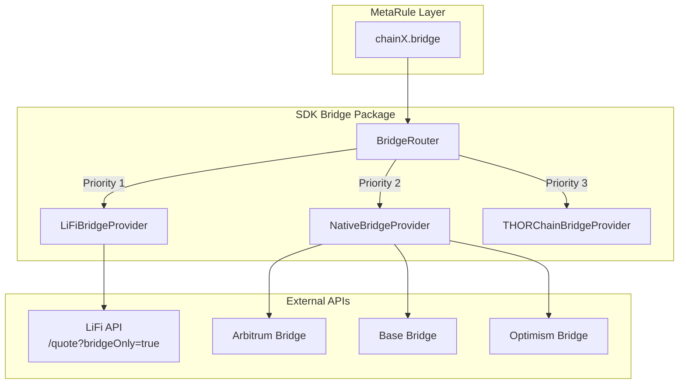

# Canonical Bridge Router Implementation

## Overview

Bridge operations differ from swaps: they move the **same asset** across chains (USDC on ETH to USDC on Arbitrum) rather than converting between different assets. We'll follow the established swap router pattern in [`sdk/swap/`](recipes/sdk/swap/) to create a parallel `sdk/bridge/` package.

## Architecture



## Key Differences from Swap

| Aspect | Swap | Bridge |
|--------|------|--------|
| Assets | Different (ETH to BTC) | Same (USDC to USDC) |
| Use Case | Token conversion | Cross-chain transfer |
| Providers | THORChain, 1inch, Jupiter | LiFi, Native L2, THORChain synths |
| Slippage | Expected | Minimal (same asset) |

## Implementation Plan

### Phase 1: SDK Bridge Package

Create [`sdk/bridge/`](recipes/sdk/bridge/) mirroring the swap pattern:

1. **Types** (`types.go`)
   - `BridgeProvider` interface (Name, Priority, SupportedRoutes, GetQuote, BuildTx)
   - `BridgeAsset` struct (Chain, Symbol, Address, Decimals)
   - `BridgeQuoteRequest` / `BridgeQuote` / `BridgeResult` types

2. **Router** (`router.go`)
   - Priority-based provider selection
   - Route validation (same asset check)
   - `NewDefaultBridgeRouter()` with LiFi + Native providers

3. **LiFi Bridge Provider** (`lifi.go`)
   - Use LiFi's bridge-specific endpoint with `allowBridges` filter
   - Leverage existing [`resolver/lifi_router.go`](recipes/resolver/lifi_router.go) for contract addresses

4. **Native Bridge Provider** (`native.go`)
   - Arbitrum Gateway (L2 to L1, L1 to L2)
   - Base/Optimism Standard Bridge
   - Direct contract interaction for canonical bridges

### Phase 2: Metarule Integration

Add `bridge` protocol to [`metarule/metarule.go`](recipes/metarule/metarule.go):

```go
const (
    send metaProtocol = "send"
    swap metaProtocol = "swap"
    bridge metaProtocol = "bridge"  // NEW
)
```

Bridge constraints structure:
- `from_chain` - Source chain
- `to_chain` - Destination chain  
- `from_address` - Sender address
- `to_address` - Recipient address (typically same on both chains)
- `amount` - Amount to bridge
- `asset` - Token address being bridged

### Phase 3: Resolver Updates

Add magic constants to [`proto/constraint.proto`](recipes/proto/constraint.proto):
- `ARBITRUM_GATEWAY` - Arbitrum L1 Gateway
- `BASE_BRIDGE` - Base Standard Bridge
- `OPTIMISM_BRIDGE` - Optimism Standard Bridge

Create resolvers in [`resolver/`](recipes/resolver/):
- `arbitrum_bridge.go`
- `base_bridge.go`  
- `optimism_bridge.go`

### Phase 4: Engine Support

Add bridge validation to chain engines in [`engine/`](recipes/engine/) for supported chains:
- EVM chains (Ethereum, Arbitrum, Base, Optimism)
- Validate bridge contract calls
- Parse bridge transaction parameters

## Provider Priority

1. **LiFi** (Priority 1) - Aggregates multiple bridges, best rates
2. **Native Bridges** (Priority 2) - Cheapest for L2-to-L1 (Arbitrum, Base, Optimism)
3. **THORChain** (Priority 3) - BTC/ETH synths for non-EVM chains

## File Structure

```
recipes/sdk/bridge/
├── types.go           # BridgeProvider interface, request/response types
├── router.go          # BridgeRouter with priority selection
├── bridge.go          # Package docs & convenience functions
├── lifi.go            # LiFi bridge provider
├── native.go          # Native L2 bridge provider
├── native_arbitrum.go # Arbitrum Gateway implementation
├── native_base.go     # Base Standard Bridge implementation
├── native_optimism.go # Optimism Standard Bridge implementation
└── router_test.go     # Tests
```

## Supported Routes (Initial)

| From | To | Provider |
|------|-----|----------|
| Any EVM | Any EVM | LiFi |
| Arbitrum | Ethereum | Native + LiFi |
| Base | Ethereum | Native + LiFi |
| Optimism | Ethereum | Native + LiFi |
| Ethereum | L2s | Native + LiFi |