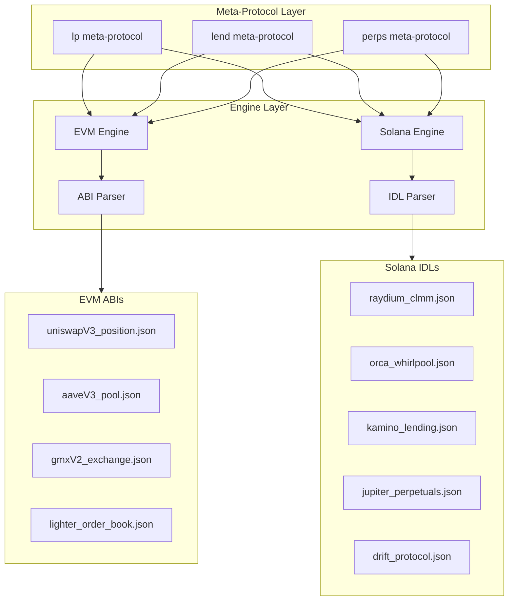

# DeFi Recipes Implementation Plan

## Architecture Overview

The recipes system has 3 key layers for DeFi:



## Proposed High-Level Interfaces (Meta-Protocols)

### 1. `lp` - Liquidity Pool Management

```javascript
Resource: {chain}.lp
Parameters:
    - action: "add" | "remove" | "collect_fees"
    - protocol: "uniswap_v3" | "raydium" | "orca" | "meteora"
    - pool: address/pubkey (LP pool/position NFT token ID)
    - token0: address/pubkey (or empty for native)
    - token1: address/pubkey
    - amount0: uint256 (for add; max fees to collect for collect_fees)
    - amount1: uint256 (for add; max fees to collect for collect_fees)
    - min_amount0: uint256 (slippage protection for add/remove)
        - min_amount1: uint256
    - recipient: address/pubkey
```

**Supported Protocols:**| Protocol | Chain | Type ||----------|-------|------|| Uniswap V3 | EVM (Ethereum, Arbitrum, Base, etc.) | Concentrated liquidity || Raydium CLMM | Solana | Concentrated liquidity || Orca Whirlpools | Solana | Concentrated liquidity || Meteora | Solana | Dynamic pools |**Action mappings (EVM - UniswapV3):**

- `add` -> `NonfungiblePositionManager.mint()` or `.increaseLiquidity()`
- `remove` -> `.decreaseLiquidity()` + `.collect()`
- `collect_fees` -> `.collect()` (withdraws accumulated trading fees without affecting liquidity)

**Action mappings (Solana):**

- `add` -> `raydium.open_position()` / `orca.open_position()` / `meteora.add_liquidity()`
- `remove` -> `*.close_position()` or `*.remove_liquidity()`
- `collect_fees` -> `*.collect_fees()` / `*.harvest()`

### 2. `lend` - Lending Protocol Management

```javascript
Resource: {chain}.lend
Parameters:
        - action: "supply" | "withdraw" | "borrow" | "repay"
    - protocol: "aave" | "compound" | "kamino" | "marginfi" | "solend"
    - asset: address/pubkey
        - amount: uint256
    - on_behalf_of: address/pubkey (optional)
    - collateral: bool (for Solana - enable as collateral on supply)
```

**Supported Protocols:**| Protocol | Chain | Notes ||----------|-------|-------|| AAVE V3 | EVM (Ethereum, Arbitrum, Base, etc.) | Variable/stable rates || Compound V3 | EVM (Ethereum, Arbitrum, Base, etc.) | Single-asset markets || Kamino Finance | Solana | Integrated with Kamino vaults || Marginfi | Solana | Risk-adjusted rates || Solend | Solana | Isolated pools |**Action mappings (EVM):**

- `supply` -> `aaveV3_pool.supply()` / `compoundV3_comet.supply()`
- `withdraw` -> `.withdraw()`
- `borrow` -> `.borrow()`
- `repay` -> `.repay()`

**Action mappings (Solana):**

- `supply` -> `kamino.deposit()` / `marginfi.deposit()` / `solend.deposit()`
- `withdraw` -> `*.withdraw()`
- `borrow` -> `*.borrow()`
- `repay` -> `*.repay()`

### 3. `perps` - Perpetuals Trading

```javascript
Resource: {chain}.perps
Parameters:
        - action: "open_long" | "open_short" | "close" | "adjust_margin"
    - protocol: "gmx" | "hyperliquid" | "lighter" | "jupiter_perps" | "drift"
    - market: address/pubkey (market identifier)
        - size_delta: uint256
        - collateral_delta: uint256
    - collateral_token: address (for multi-collateral protocols)
        - acceptable_price: uint256
    - execution_fee: uint256 (for async execution protocols)
    - leverage: uint256 (optional, for protocols that set leverage on open)
```

**Supported Protocols:**

- **GMX V2** (Arbitrum, Avalanche) - EVM, async execution via keepers
- **Hyperliquid** (Hyperliquid L1) - Custom L1 with EVM bridge, order-book based
                                                                                                                                - Note: HL uses EIP-712 style signing on custom L1. Initial support via EVM bridge for deposits/withdrawals; native trading may require dedicated chain handler
- **Lighter** (Arbitrum) - EVM, order-book perps
- **Jupiter Perps** (Solana) - Solana IDL, oracle-based pricing
- **Drift Protocol** (Solana) - Solana IDL, vAMM + order-book hybrid

### 4. `bet` - Prediction Markets (Betting)

```javascript
Resource: {chain}.bet
Parameters:
    - action: "buy" | "sell" | "cancel"
    - protocol: "polymarket"
    - market: uint256 (Polymarket CTF `tokenId` for the outcome token you want to trade)
    - amount: uint256 (`fillAmount` for `CTFExchange.fillOrder`; typically max size you want to fill)
    - price: uint256 (optional, limit price in basis points 0-10000)
    - maker: address (the maker's address for order matching)
```

**Supported Protocols:**

| Protocol | Chain | Type | Notes |

|----------|-------|------|-------|

| Polymarket | Polygon | Conditional Tokens Framework (CTF) | CLOB-based prediction market, USDC collateral |

**Action mappings (EVM - Polymarket):**

- `buy` -> `CTFExchange.fillOrder()` (execute buy order for outcome tokens)
- `sell` -> `CTFExchange.fillOrder()` (execute sell order for outcome tokens)
- `cancel` -> `CTFExchange.cancelOrder()` (cancel pending order)

**Order Structure:**

Polymarket uses an order-based system where orders contain:

- `tokenId`: The conditional token ID representing YES or NO outcome
- `maker`/`taker`: Order participants
- `makerAmount`/`takerAmount`: Amounts being exchanged
- `side`: 0 for BUY, 1 for SELL
- `feeRateBps`: Fee rate in basis points
- `expiration`: Order expiry timestamp
- `nonce`: Unique order identifier

**Required approvals (Polygon):**

- `CTF.setApprovalForAll(exchange, true)` to let the exchange transfer your CTF (ERC1155-style) positions
- For `buy`: `USDC.approve(exchange, amount)` to let the exchange pull collateral

**Contract Addresses (Polygon):**

- CTF Exchange: `0x4bFb41d5B3570DeFd03C39a9A4D8dE6Bd8B8982E`
- Neg Risk CTF Exchange: `0xC5d563A36AE78145C45a50134d48A1215220f80a`
- CTF (Conditional Tokens): `0x4D97DCd97eC945f40cF65F87097ACe5EA0476045`
- USDC.e: `0x2791Bca1f2de4661ED88A30C99A7a9449Aa84174`

## Implementation Plan

### Phase 1: ABI/IDL Layer - Add Protocol Interfaces

**EVM ABIs** - Add to [`chain/evm/abi/`](chain/evm/abi/):

- `uniswapV3_nonfungible_position_manager.json` - UniswapV3 LP positions
- `aaveV3_pool.json` - AAVE V3 lending pool
- `compoundV3_comet.json` - Compound V3 (Comet) market
- `gmxV2_exchange_router.json` - GMX V2 perpetuals (Arbitrum, Avalanche)
- `lighter_order_book.json` - Lighter perps (Arbitrum)
- `hyperliquid_exchange.json` - Hyperliquid L1 bridge (EVM side)
- `polymarket_ctf_exchange.json` - Polymarket CTF Exchange (Polygon) ✅
- `polymarket_ctf.json` - Polymarket CTF (ERC1155-style approvals) ✅

**Solana IDLs** - Add to [`idl/`](idl/):*LP:*

- `raydium_clmm.json` - Raydium concentrated liquidity
- `orca_whirlpool.json` - Orca Whirlpools
- `meteora_pools.json` - Meteora dynamic pools

*Lending:*

- `kamino_lending.json` - Kamino Finance
- `marginfi.json` - Marginfi lending
- `solend.json` - Solend protocol

*Perps:*

- `jupiter_perpetuals.json` - Jupiter Perps program
- `drift_protocol.json` - Drift Protocol program

### Phase 2: Protocol Registry - Router Addresses

Create [`chain/evm/defi_registry.go`](chain/evm/defi_registry.go) with:

- Uniswap V3 Position Manager addresses per chain
- AAVE V3 Pool addresses per chain
- Compound V3 Comet addresses per chain/market
- GMX V2 Exchange Router addresses (Arbitrum)

### Phase 3: Meta-Protocol Handlers

Extend [`metarule/metarule.go`](metarule/metarule.go) to handle new meta-protocols:

```go
const (
    send  metaProtocol = "send"
    swap  metaProtocol = "swap"
    lp    metaProtocol = "lp"      // LP management
    lend  metaProtocol = "lend"    // Lending protocols
    perps metaProtocol = "perps"   // Perpetuals trading
    bet   metaProtocol = "bet"     // Prediction markets (betting)
)
```

Each handler transforms high-level intent to chain-specific calls:**`lp` (routes by chain + protocol):**

- EVM: `uniswapV3_position_manager.mint()` / `.increaseLiquidity()` / `.decreaseLiquidity()` / `.collect()`
- Solana: `raydium_clmm.open_position()` / `orca_whirlpool.open_position()` / `meteora.add_liquidity()`

**`lend` (routes by chain + protocol):**

- EVM: `aaveV3_pool.supply()` / `compoundV3_comet.supply()` etc.
- Solana: `kamino.deposit()` / `marginfi.deposit()` / `solend.deposit()` etc.

**`perps` (routes by chain + protocol):**

- EVM:
- `gmx` -> `gmxV2_exchange.createOrder()`
- `lighter` -> `lighter_order_book.placeOrder()`
- `hyperliquid` -> Custom HL L1 signing or EVM bridge
- Solana:
- `jupiter_perps` -> `jupiter_perpetuals.increase_size()` / `.decrease_size()`
- `drift` -> `drift.place_perp_order()` / `.close_position()`

### Phase 4: Validators (Optional Enhancement)

Extend existing pattern from [`chain/evm/ethereum/uniswap_validator.go`](chain/evm/ethereum/uniswap_validator.go):

- Add validators for AAVE (health factor checks)
- Add validators for perpetuals (margin requirements, liquidation risk)

## Chain Support Matrix

### LP Protocols

| Protocol | Type | EVM Chains | Solana ||----------|------|------------|--------|| Uniswap V3 | Concentrated | Ethereum, Arbitrum, Optimism, Base, Polygon | - || Raydium CLMM | Concentrated | - | Yes || Orca Whirlpools | Concentrated | - | Yes || Meteora | Dynamic | - | Yes |

### Lending Protocols

| Protocol | EVM Chains | Solana ||----------|------------|--------|| AAVE V3 | Ethereum, Arbitrum, Optimism, Base, Polygon, Avalanche | - || Compound V3 | Ethereum, Arbitrum, Base, Polygon | - || Kamino | - | Yes || Marginfi | - | Yes || Solend | - | Yes |

### Perpetuals Protocols

| Protocol | Chain(s) | Type | Notes ||----------|----------|------|-------|| GMX V2 | Arbitrum, Avalanche | EVM | Oracle-based, async execution || Lighter | Arbitrum | EVM | Order-book based || Hyperliquid | Hyperliquid L1 | Custom | Native L1 signing, EVM bridge for deposits || Jupiter Perps | Solana | SVM | Uses Jupiter infrastructure || Drift Protocol | Solana | SVM | vAMM + DLOB hybrid |

### Prediction Markets (Betting) Protocols

| Protocol | Chain(s) | Type | Notes |

|----------|----------|------|-------|

| Polymarket | Polygon | EVM | CLOB-based, CTF framework, USDC collateral |

## Developer Custom ABI Support

For advanced use cases beyond the simple interfaces:

1. Developers can add their own ABI JSON files to `chain/evm/abi/`
2. Use the existing resource pattern: `{chain}.{protocol_id}.{function}`
3. The EVM engine automatically parses and validates any ABI

Example custom recipe rule:

```json
{
  "resource": "arbitrum.custom_perp_dex.openPosition",
  "target": { "address": "0x..." },
  "parameter_constraints": [
    {"parameter_name": "size", "constraint": {"type": "max", "value": "1000000000000"}}
  ]
}
```

## Key Files to Create/Modify

### EVM ABIs

| File | Purpose ||------|---------|| `chain/evm/abi/uniswapV3_nonfungible_position_manager.json` | UniswapV3 LP positions || `chain/evm/abi/aaveV3_pool.json` | AAVE V3 lending pool || `chain/evm/abi/compoundV3_comet.json` | Compound V3 market || `chain/evm/abi/gmxV2_exchange_router.json` | GMX V2 perps (Arbitrum, Avalanche) || `chain/evm/abi/lighter_order_book.json` | Lighter perps (Arbitrum) || `chain/evm/abi/hyperliquid_exchange.json` | Hyperliquid EVM bridge |

### Solana IDLs

| File | Purpose |

|------|---------|

| `idl/raydium_clmm.json` | Raydium concentrated liquidity LP |

| `idl/orca_whirlpool.json` | Orca Whirlpools LP |

| `idl/meteora_pools.json` | Meteora dynamic pools LP |

| `idl/kamino_lending.json` | Kamino Finance lending |

| `idl/marginfi.json` | Marginfi lending |

| `idl/solend.json` | Solend protocol |

| `idl/jupiter_perpetuals.json` | Jupiter Perps program |

| `idl/drift_protocol.json` | Drift Protocol program |

### Core Files

| File | Action | Purpose |

|------|--------|---------|

| `chain/evm/defi_registry.go` | Create | EVM protocol addresses per chain |

| `chain/solana/defi_registry.go` | Create | Solana program IDs per protocol |

| `metarule/metarule.go` | Modify | Add lp/lend/perps meta-protocol handlers |

| `metarule/internal/defi/` | Create | DeFi-specific helpers |

| `metarule/internal/defi/lp_router.go` | Create | Route LP by chain + protocol |

| `metarule/internal/defi/lend_router.go` | Create | Route lending by chain + protocol |